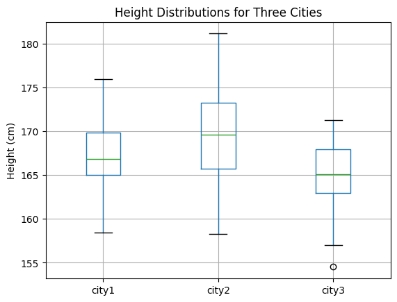

## Introduction

**Inferential statistics** allows us to make conclusions about populations based on sample data. Unlike descriptive statistics, which summarize data we have, inferential statistics help us make predictions and test hypotheses about larger populations.

## Learning Objectives

By the end of this module, you will be able to:

- Understand different sampling methods and their applications
- Explain the Central Limit Theorem and its importance
- Calculate and interpret confidence intervals
- Perform hypothesis testing using various statistical tests
- Understand Type I and Type II errors
- Calculate and interpret statistical power and effect size
- Apply inferential statistics using Python

## Prerequisites

Before starting this module, you should be familiar with:
- [Descriptive Statistics](02_descriptive_statistics.md)
- [Probability Foundations](03_probability_foundations.md)
- Basic Python programming

<!-- Newsletter -->
<div class="newsletter">
<div class="newsletter-heading">
<h4><i class="bi bi-info-circle-fill"></i> Don't Miss Any Updates!</h4>
</div>
<div class="newsletter-body">
<p>
Before we continue, we have a humble request, to be among the first to hear about future updates of the course materials, simply enter your email below, follow us on <a href="https://x.com/dataideaorg"><i class="bi bi-twitter-x"></i>
(formally Twitter)</a>, or subscribe to our <a href="https://www.youtube.com/@dataideaorg"><i class="bi bi-youtube"></i> YouTube channel</a>.
</p>
<iframe class="newsletter-frame" src="https://embeds.beehiiv.com/5fc7c425-9c7e-4e08-a514-ad6c22beee74?slim=true" data-test-id="beehiiv-embed" height="52" frameborder="0" scrolling="no">
</iframe>
</div>
</div>

## 1. Sampling Methods

**Sampling** is the process of selecting a subset of individuals from a population to represent the entire population. The quality of our statistical inferences depends heavily on how we sample.

### Simple Random Sampling

Every individual in the population has an equal chance of being selected.

```python
import numpy as np
import pandas as pd

# Example: Simple random sampling
population = np.arange(1, 1001)  # Population of 1000 individuals
sample_size = 100

# Simple random sample
random_sample = np.random.choice(population, size=sample_size, replace=False)
print(f"Random sample (first 10): {random_sample[:10]}")
```

### Stratified Sampling

Divide the population into strata (groups) and sample from each stratum proportionally.

```python
# Example: Stratified sampling by age groups
# Population: 1000 people, 40% young (18-30), 35% middle (31-50), 25% old (51+)

young = np.random.normal(25, 3, 400)  # 400 young people
middle = np.random.normal(40, 5, 350)  # 350 middle-aged
old = np.random.normal(60, 7, 250)    # 250 older people

# Stratified sample: 10% from each group
sample_young = np.random.choice(young, size=40, replace=False)
sample_middle = np.random.choice(middle, size=35, replace=False)
sample_old = np.random.choice(old, size=25, replace=False)

stratified_sample = np.concatenate([sample_young, sample_middle, sample_old])
print(f"Stratified sample size: {len(stratified_sample)}")
print(f"Mean age: {np.mean(stratified_sample):.2f}")
```

### Systematic Sampling

Select every kth individual from the population.

```python
# Systematic sampling: every 10th person
k = 10
systematic_sample = population[::k]
print(f"Systematic sample (first 10): {systematic_sample[:10]}")
```

### Cluster Sampling

Divide population into clusters and randomly select entire clusters.

```python
# Example: Cluster sampling by neighborhoods
neighborhoods = {
    'A': np.random.normal(50, 10, 200),
    'B': np.random.normal(55, 12, 150),
    'C': np.random.normal(48, 8, 180),
    'D': np.random.normal(52, 11, 170),
    'E': np.random.normal(49, 9, 300)
}

# Randomly select 2 clusters
selected_clusters = np.random.choice(list(neighborhoods.keys()), size=2, replace=False)
cluster_sample = np.concatenate([neighborhoods[cluster] for cluster in selected_clusters])
print(f"Selected clusters: {selected_clusters}")
print(f"Cluster sample size: {len(cluster_sample)}")
```

## 2. Central Limit Theorem (CLT)

The **Central Limit Theorem** is one of the most important theorems in statistics. It states:

> As the sample size increases, the distribution of sample means approaches a normal distribution, regardless of the shape of the population distribution.

**Key Points:**
- The mean of sample means equals the population mean: $\mu_{\bar{x}} = \mu$
- The standard deviation of sample means (standard error) is: $\sigma_{\bar{x}} = \frac{\sigma}{\sqrt{n}}$
- Works well for sample sizes n ≥ 30

```python
import matplotlib.pyplot as plt
from scipy import stats

# Demonstrate CLT with a non-normal population
np.random.seed(42)
population = np.random.exponential(scale=2, size=10000)  # Exponential (not normal)

# Plot population distribution
plt.figure(figsize=(15, 5))

plt.subplot(1, 3, 1)
plt.hist(population, bins=50, density=True, alpha=0.7, color='blue')
plt.title('Population Distribution (Exponential)')
plt.xlabel('Value')
plt.ylabel('Density')

# Take many samples and calculate means
sample_means = []
for _ in range(1000):
    sample = np.random.choice(population, size=30, replace=False)
    sample_means.append(np.mean(sample))

# Plot distribution of sample means
plt.subplot(1, 3, 2)
plt.hist(sample_means, bins=50, density=True, alpha=0.7, color='green')
plt.title('Distribution of Sample Means (n=30)')
plt.xlabel('Sample Mean')
plt.ylabel('Density')

# Overlay normal distribution
mu_sample = np.mean(sample_means)
sigma_sample = np.std(sample_means)
x = np.linspace(mu_sample - 4*sigma_sample, mu_sample + 4*sigma_sample, 100)
y = stats.norm.pdf(x, mu_sample, sigma_sample)
plt.plot(x, y, 'r-', linewidth=2, label='Normal Distribution')
plt.legend()

# Compare with larger sample size
sample_means_large = []
for _ in range(1000):
    sample = np.random.choice(population, size=100, replace=False)
    sample_means_large.append(np.mean(sample))

plt.subplot(1, 3, 3)
plt.hist(sample_means_large, bins=50, density=True, alpha=0.7, color='orange')
plt.title('Distribution of Sample Means (n=100)')
plt.xlabel('Sample Mean')
plt.ylabel('Density')

mu_large = np.mean(sample_means_large)
sigma_large = np.std(sample_means_large)
x = np.linspace(mu_large - 4*sigma_large, mu_large + 4*sigma_large, 100)
y = stats.norm.pdf(x, mu_large, sigma_large)
plt.plot(x, y, 'r-', linewidth=2, label='Normal Distribution')
plt.legend()

plt.tight_layout()
plt.show()

print(f"Population mean: {np.mean(population):.3f}")
print(f"Mean of sample means (n=30): {mu_sample:.3f}")
print(f"Mean of sample means (n=100): {mu_large:.3f}")
print(f"\nStandard error (n=30): {sigma_sample:.3f}")
print(f"Standard error (n=100): {sigma_large:.3f}")
print(f"Theoretical SE (n=30): {np.std(population)/np.sqrt(30):.3f}")
print(f"Theoretical SE (n=100): {np.std(population)/np.sqrt(100):.3f}")
```

**Why CLT Matters:**
- Allows us to use normal distribution for inference even when population isn't normal
- Enables calculation of confidence intervals and p-values
- Foundation for many statistical tests

## 3. Confidence Intervals

A **confidence interval** is a range of values that likely contains the true population parameter. A 95% confidence interval means that if we repeated the sampling process many times, 95% of the intervals would contain the true parameter.

### Confidence Interval for Mean (Known σ)

When population standard deviation is known:

$$\bar{x} \pm z_{\alpha/2} \cdot \frac{\sigma}{\sqrt{n}}$$

### Confidence Interval for Mean (Unknown σ)

When population standard deviation is unknown (more common):

$$\bar{x} \pm t_{\alpha/2, df} \cdot \frac{s}{\sqrt{n}}$$

where df = n - 1 (degrees of freedom)

```python
# Example: Confidence interval for mean
np.random.seed(42)
sample = np.random.normal(50, 10, 30)  # Sample from population with μ=50, σ=10

sample_mean = np.mean(sample)
sample_std = np.std(sample, ddof=1)  # Sample standard deviation
n = len(sample)
confidence_level = 0.95
alpha = 1 - confidence_level

# Using t-distribution (unknown population std)
t_critical = stats.t.ppf(1 - alpha/2, df=n-1)
margin_error = t_critical * (sample_std / np.sqrt(n))

ci_lower = sample_mean - margin_error
ci_upper = sample_mean + margin_error

print(f"Sample mean: {sample_mean:.3f}")
print(f"Sample std: {sample_std:.3f}")
print(f"95% Confidence Interval: [{ci_lower:.3f}, {ci_upper:.3f}]")
print(f"Margin of error: {margin_error:.3f}")

# Using scipy for convenience
ci = stats.t.interval(confidence_level, df=n-1, loc=sample_mean, scale=stats.sem(sample))
print(f"\nUsing scipy: [{ci[0]:.3f}, {ci[1]:.3f}]")
```

### Confidence Interval for Proportion

For proportions:

$$\hat{p} \pm z_{\alpha/2} \cdot \sqrt{\frac{\hat{p}(1-\hat{p})}{n}}$$

```python
# Example: Confidence interval for proportion
# Survey: 450 out of 1000 people support a policy
n = 1000
x = 450
p_hat = x / n

z_critical = stats.norm.ppf(0.975)  # For 95% CI
se = np.sqrt(p_hat * (1 - p_hat) / n)
margin_error = z_critical * se

ci_lower = p_hat - margin_error
ci_upper = p_hat + margin_error

print(f"Sample proportion: {p_hat:.3f}")
print(f"95% Confidence Interval: [{ci_lower:.3f}, {ci_upper:.3f}]")
```

**Interpreting Confidence Intervals:**
- We are 95% confident that the true population parameter lies within the interval
- The interval does NOT mean there's a 95% chance the parameter is in the interval (it either is or isn't)
- Wider intervals indicate more uncertainty

## 4. Hypothesis Testing

**Hypothesis Testing** is a statistical method used to make decisions or inferences about a population parameter based on sample data.

<!-- Newsletter -->
<div class="newsletter">
<div class="newsletter-heading">
<h4><i class="bi bi-info-circle-fill"></i> Don't Miss Any Updates!</h4>
</div>
<div class="newsletter-body">
<p>
Before we continue, we have a humble request, to be among the first to hear about future updates of the course materials, simply enter your email below, follow us on <a href="https://x.com/dataideaorg"><i class="bi bi-twitter-x"></i>
(formally Twitter)</a>, or subscribe to our <a href="https://www.youtube.com/@dataideaorg"><i class="bi bi-youtube"></i> YouTube channel</a>.
</p>
<iframe class="newsletter-frame" src="https://embeds.beehiiv.com/5fc7c425-9c7e-4e08-a514-ad6c22beee74?slim=true" data-test-id="beehiiv-embed" height="52" frameborder="0" scrolling="no">
</iframe>
</div>
</div>

## 1. What is Hypothesis Testing?
**Hypothesis Testing** is a statistical method used to make decisions or inferences about a population parameter based on sample data. It helps determine if there is enough evidence to reject a null hypothesis in favor of an alternative hypothesis.

## 2. Types of Hypotheses
1. **Null Hypothesis (H₀)**: This is the default assumption that there is no effect or no difference. For example, "There is no difference in mean height between men and women."
2. **Alternative Hypothesis (H₁)**: This opposes the null hypothesis, stating that there is an effect or difference. For example, "There is a difference in mean height between men and women."

## 3. Steps in Hypothesis Testing
1. **Define Hypotheses**: Set the null and alternative hypotheses.
2. **Select Significance Level (α)**: The probability threshold (commonly 0.05) below which the null hypothesis is rejected.
3. **Choose the Test Statistic**: Based on the type of data and sample size, e.g., t-test, chi-square test.
4. **Compute p-value**: This is the probability of observing the data if the null hypothesis is true.
5. **Make a Decision**:
   - If p-value < α, reject the null hypothesis.
   - If p-value ≥ α, fail to reject the null hypothesis.

## 4. Common Hypothesis Tests
1. **One-sample t-test**: Tests whether the mean of a sample is significantly different from a known or hypothesized value.
2. **Two-sample t-test**: Compares the means of two independent samples.
3. **Chi-square test**: Tests for association between categorical variables.

## 5. Example: Hypothesis Testing in Python

### (a) Import Libraries


```python
import numpy as np
import pandas as pd
from scipy import stats
import matplotlib.pyplot as plt
```

### (b) One-sample t-test

**Scenario**: You want to test whether the average height of people in a town is 170 cm. You take a sample of 30 people and record their heights.


```python
# Sample data (heights of 30 people)
np.random.seed(42)  # For reproducibility
sample_heights = np.random.normal(168, 5, 30)  # mean=168, std=5

# Perform one-sample t-test
t_stat, p_value = stats.ttest_1samp(sample_heights, 170)

print(f"t-statistic: {t_stat:.4f}, p-value: {p_value:.4f}")

# Significance level
alpha = 0.05
if p_value < alpha:
    print("Reject the null hypothesis: The average height is not 170 cm.")
else:
    print("Fail to reject the null hypothesis: The average height is 170 cm.")
```

    t-statistic: -3.5793, p-value: 0.0012
    Reject the null hypothesis: The average height is not 170 cm.


### (c) Two-sample t-test

**Scenario**: You want to compare the average heights of men and women in the same town. You have the height data for 20 men and 20 women.


```python
# Heights of men and women (sample data)
np.random.seed(42)
men_heights = np.random.normal(175, 6, 20)
women_heights = np.random.normal(165, 5, 20)

# Perform two-sample t-test
t_stat, p_value = stats.ttest_ind(men_heights, women_heights)

print(f"t-statistic: {t_stat:.4f}, p-value: {p_value:.4f}")

# Decision
if p_value < alpha:
    print("Reject the null hypothesis: There is a significant difference between men's and women's heights.")
else:
    print("Fail to reject the null hypothesis: No significant difference in heights.")
```

    t-statistic: 6.1236, p-value: 0.0000
    Reject the null hypothesis: There is a significant difference between men's and women's heights.


### (d) Chi-square test

**Scenario**: You want to test whether gender and preference for a product (Yes/No) are independent in a survey.


```python
# Contingency table (sample data)
# Rows: Gender (Male, Female), Columns: Preference (Yes, No)
data = [[30, 10], [25, 15]]

# Perform chi-square test
chi2_stat, p_value, dof, expected = stats.chi2_contingency(data)

print(f"Chi-square statistic: {chi2_stat:.4f}, p-value: {p_value:.4f}")

# Decision
if p_value < alpha:
    print("Reject the null hypothesis: Gender and preference are not independent.")
else:
    print("Fail to reject the null hypothesis: Gender and preference are independent.")
```

    Chi-square statistic: 0.9309, p-value: 0.3346
    Fail to reject the null hypothesis: Gender and preference are independent.


### (e) ANOVA (Analysis of Variance)

**Scenario**: You want to compare the average heights of people from three different cities to see if there is a statistically significant difference in their means.

**Hypotheses**:
- **H₀** (Null Hypothesis): The means of all groups are equal.
- **H₁** (Alternative Hypothesis): At least one group has a different mean.


```python
# Simulate data for three cities (heights)
np.random.seed(42)
city1_heights = np.random.normal(168, 5, 30)
city2_heights = np.random.normal(170, 6, 30)
city3_heights = np.random.normal(165, 4, 30)

# Combine data into a pandas DataFrame
df = pd.DataFrame({
    'city1': city1_heights,
    'city2': city2_heights,
    'city3': city3_heights
})

# Visualize the data
df.boxplot()
plt.title('Height Distributions for Three Cities')
plt.ylabel('Height (cm)')
plt.show()

# Perform ANOVA test
f_stat, p_value = stats.f_oneway(city1_heights, city2_heights, city3_heights)

print(f"F-statistic: {f_stat:.4f}, p-value: {p_value:.4f}")

# Decision
alpha = 0.05
if p_value < alpha:
    print("Reject the null hypothesis: At least one city has a different mean height.")
else:
    print("Fail to reject the null hypothesis: All cities have the same mean height.")
```


    

    


    F-statistic: 5.9711, p-value: 0.0037
    Reject the null hypothesis: At least one city has a different mean height.


## Explanation of ANOVA
<i class="bi bi-cursor"></i> **F-statistic**: A ratio of the variance between the group means to the variance within the groups. A higher F-statistic indicates a greater disparity between group means.

## 5. Type I and Type II Errors

When performing hypothesis tests, we can make two types of errors:

### Type I Error (False Positive)
- **Definition**: Rejecting the null hypothesis when it is actually true
- **Probability**: Denoted by α (alpha), the significance level
- **Example**: Concluding a drug is effective when it's not

### Type II Error (False Negative)
- **Definition**: Failing to reject the null hypothesis when it is actually false
- **Probability**: Denoted by β (beta)
- **Example**: Concluding a drug is not effective when it actually is

```python
# Visualizing Type I and Type II errors
from scipy.stats import norm
import matplotlib.patches as mpatches

# Example: Testing if mean = 100
# H0: μ = 100, H1: μ ≠ 100
mu0 = 100
mu1 = 105  # True mean (if H0 is false)
sigma = 10
n = 30
alpha = 0.05

# Critical values for two-tailed test
z_critical = stats.norm.ppf(1 - alpha/2)
se = sigma / np.sqrt(n)
critical_lower = mu0 - z_critical * se
critical_upper = mu0 + z_critical * se

# Plot distributions
x = np.linspace(85, 120, 1000)
y0 = norm.pdf(x, mu0, se)  # Distribution under H0
y1 = norm.pdf(x, mu1, se)   # Distribution under H1

plt.figure(figsize=(12, 6))
plt.plot(x, y0, 'b-', linewidth=2, label='H0: μ = 100')
plt.plot(x, y1, 'r-', linewidth=2, label='H1: μ = 105')

# Shade Type I error region (reject H0 when H0 is true)
x_type1 = np.linspace(critical_upper, 120, 100)
y_type1 = norm.pdf(x_type1, mu0, se)
plt.fill_between(x_type1, 0, y_type1, alpha=0.3, color='blue', label='Type I Error (α)')

x_type1_lower = np.linspace(85, critical_lower, 100)
y_type1_lower = norm.pdf(x_type1_lower, mu0, se)
plt.fill_between(x_type1_lower, 0, y_type1_lower, alpha=0.3, color='blue')

# Shade Type II error region (fail to reject H0 when H1 is true)
x_type2 = np.linspace(critical_lower, critical_upper, 100)
y_type2 = norm.pdf(x_type2, mu1, se)
plt.fill_between(x_type2, 0, y_type2, alpha=0.3, color='red', label='Type II Error (β)')

# Critical values
plt.axvline(critical_lower, color='black', linestyle='--', linewidth=1.5, label='Critical Values')
plt.axvline(critical_upper, color='black', linestyle='--', linewidth=1.5)

plt.xlabel('Sample Mean')
plt.ylabel('Probability Density')
plt.title('Type I and Type II Errors in Hypothesis Testing')
plt.legend()
plt.grid(True, alpha=0.3)
plt.show()

# Calculate Type II error probability
beta = norm.cdf(critical_upper, mu1, se) - norm.cdf(critical_lower, mu1, se)
power = 1 - beta

print(f"Type I Error (α): {alpha}")
print(f"Type II Error (β): {beta:.4f}")
print(f"Statistical Power (1 - β): {power:.4f}")
```

**Trade-off:**
- Decreasing α (Type I error) increases β (Type II error)
- Increasing sample size decreases both errors
- Power = 1 - β (probability of correctly rejecting false H0)

## 6. Statistical Power

**Statistical power** is the probability of correctly rejecting a false null hypothesis. It's the complement of Type II error: Power = 1 - β.

**Factors affecting power:**
1. **Effect size**: Larger effects are easier to detect
2. **Sample size**: Larger samples increase power
3. **Significance level (α)**: Higher α increases power (but also Type I error)
4. **Variability**: Less variability increases power

```python
# Calculating power for different scenarios
from scipy.stats import norm

def calculate_power(mu0, mu1, sigma, n, alpha=0.05, two_tailed=True):
    """Calculate statistical power for a one-sample z-test"""
    se = sigma / np.sqrt(n)
    
    if two_tailed:
        z_critical = norm.ppf(1 - alpha/2)
        critical_lower = mu0 - z_critical * se
        critical_upper = mu0 + z_critical * se
        # Power = P(reject H0 | H1 is true)
        power = 1 - (norm.cdf(critical_upper, mu1, se) - norm.cdf(critical_lower, mu1, se))
    else:
        z_critical = norm.ppf(1 - alpha)
        critical = mu0 + z_critical * se
        power = 1 - norm.cdf(critical, mu1, se)
    
    return power

# Power analysis: How does sample size affect power?
sample_sizes = np.arange(10, 201, 10)
powers = [calculate_power(100, 105, 10, n) for n in sample_sizes]

plt.figure(figsize=(10, 6))
plt.plot(sample_sizes, powers, 'b-', linewidth=2, marker='o')
plt.axhline(0.8, color='r', linestyle='--', label='80% Power (Common Target)')
plt.xlabel('Sample Size')
plt.ylabel('Statistical Power')
plt.title('Statistical Power vs Sample Size\n(H0: μ=100, H1: μ=105, σ=10, α=0.05)')
plt.grid(True, alpha=0.3)
plt.legend()
plt.show()

# Find sample size needed for 80% power
target_power = 0.8
for n in sample_sizes:
    if calculate_power(100, 105, 10, n) >= target_power:
        print(f"Sample size needed for {target_power*100}% power: {n}")
        break
```

**Power Analysis:**
- Before conducting a study, calculate required sample size for desired power
- Common target: 80% power (β = 0.20)
- Low power increases risk of missing real effects

## 7. Effect Size

**Effect size** measures the magnitude of a difference or relationship, independent of sample size. Unlike p-values, effect sizes are not affected by sample size.

### Cohen's d (for means)

$$d = \frac{\mu_1 - \mu_2}{\sigma_{pooled}}$$

where $\sigma_{pooled} = \sqrt{\frac{\sigma_1^2 + \sigma_2^2}{2}}$

**Interpretation:**
- Small: d ≈ 0.2
- Medium: d ≈ 0.5
- Large: d ≈ 0.8

```python
# Calculate Cohen's d
def cohens_d(group1, group2):
    """Calculate Cohen's d effect size"""
    n1, n2 = len(group1), len(group2)
    var1, var2 = np.var(group1, ddof=1), np.var(group2, ddof=1)
    
    # Pooled standard deviation
    pooled_std = np.sqrt(((n1 - 1) * var1 + (n2 - 1) * var2) / (n1 + n2 - 2))
    
    # Cohen's d
    d = (np.mean(group1) - np.mean(group2)) / pooled_std
    return d

# Example
np.random.seed(42)
group1 = np.random.normal(100, 15, 50)
group2 = np.random.normal(105, 15, 50)

d = cohens_d(group1, group2)
print(f"Cohen's d: {d:.3f}")

# Interpret effect size
if abs(d) < 0.2:
    interpretation = "negligible"
elif abs(d) < 0.5:
    interpretation = "small"
elif abs(d) < 0.8:
    interpretation = "medium"
else:
    interpretation = "large"

print(f"Effect size: {interpretation}")

# Compare with statistical significance
t_stat, p_value = stats.ttest_ind(group1, group2)
print(f"\nt-statistic: {t_stat:.3f}")
print(f"p-value: {p_value:.4f}")
print(f"Statistically significant: {p_value < 0.05}")
print(f"Effect size: {interpretation}")
```

### Effect Size for Proportions

**Cohen's h** for proportions:

$$h = 2 \arcsin(\sqrt{p_1}) - 2 \arcsin(\sqrt{p_2})$$

### Effect Size for Correlations

**Pearson's r** is itself an effect size:
- Small: r ≈ 0.1
- Medium: r ≈ 0.3
- Large: r ≈ 0.5

**Why Effect Size Matters:**
- A statistically significant result may have a tiny effect size (practical significance)
- Large sample sizes can make trivial differences statistically significant
- Effect size helps assess practical importance

## Key Takeaways

1. **Sampling methods** affect the quality of inferences; random sampling is preferred when possible.

2. **Central Limit Theorem** allows us to use normal distribution for inference with large enough samples.

3. **Confidence intervals** provide a range of plausible values for population parameters.

4. **Hypothesis testing** helps make decisions about population parameters based on sample data.

5. **Type I errors** (false positives) and **Type II errors** (false negatives) are inherent risks in hypothesis testing.

6. **Statistical power** is the probability of detecting a true effect; aim for at least 80% power.

7. **Effect size** measures practical significance, independent of sample size.

## Applications in Data Science

- **A/B testing**: Compare two versions to determine which performs better
- **Feature selection**: Test if features are significantly related to target
- **Model validation**: Test if model performance is significantly better than baseline
- **Experimental design**: Determine sample sizes needed for reliable results

## Next Steps

Now that you understand inferential statistics, you're ready to learn about [Statistical Models](05_statistical_models.md), where we'll build models to understand relationships in data.

## Conclusion

Congratulations on completing this module! Inferential statistics provides powerful tools for making data-driven decisions. This module covered:
<ul class="cursored-list">
<li><i class="bi bi-cursor"></i> Sampling methods</li> 
<li><i class="bi bi-cursor"></i> Central Limit Theorem</li> 
<li><i class="bi bi-cursor"></i> Confidence intervals</li> 
<li><i class="bi bi-cursor"></i> Hypothesis testing (t-tests, chi-square, ANOVA)</li> 
<li><i class="bi bi-cursor"></i> Type I and Type II errors</li> 
<li><i class="bi bi-cursor"></i> Statistical power and effect size</li> 
</ul>

<h2>What's on your mind? Put it in the comments!</h2>
<script src="https://utteranc.es/client.js"
        repo="dataideaorg/dataidea-science"
        issue-term="pathname"
        theme="github-dark"
        crossorigin="anonymous"
        async>
</script>
